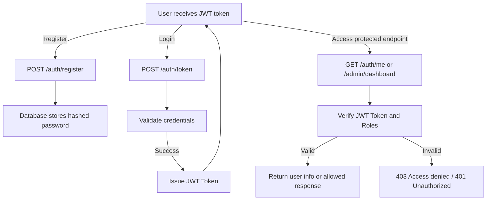

# Custom Identity Platform

A **Custom Identity Platform** built using **Python**, **FastAPI**, **SQLAlchemy**, and **PostgreSQL**.
This project provides secure user authentication with **JWT tokens**, password hashing, **Role-Based Access Control (RBAC)**, and protected API endpoints.

---

## Table of Contents

* [Features](#features)
* [Dependencies](#dependencies)
* [Setup](#setup)
* [Database Setup & Migrations](#database-setup--migrations)
* [RBAC Setup](#rbac-setup)
* [Running the Application](#running-the-application)
* [API Endpoints](#api-endpoints)
* [Quick JWT Authentication Flow Diagram](#quick-jwt-authentication-flow-diagram)
* [Expected Responses](#expected-responses)
* [Contributing](#contributing)

---

## Features

* User registration with hashed passwords
* JWT authentication with OAuth2 password flow
* Protected endpoints using JWT tokens
* Role-Based Access Control (RBAC)

  * Users ↔ Roles ↔ Permissions
  * Session management with token revocation
* Password hashing using **Passlib (bcrypt)**
* PostgreSQL database with Alembic migrations
* Clean project structure for extensibility

---

## Dependencies

This project uses **Poetry** for dependency management.

Key dependencies:

* **FastAPI** – API framework
* **SQLAlchemy** – ORM
* **psycopg2-binary** – PostgreSQL adapter
* **Alembic** – Database migrations
* **Python-JOSE** – JWT handling
* **Passlib[bcrypt]** – Password hashing
* **Authlib** – OAuth2 support
* **Pydantic-settings** – Configuration management
* **python-multipart** – Form data handling
* **email-validator** – Validates emails for user registration

---

## Setup

1. **Clone the repository**:

```bash
git clone https://github.com/henrymbuguakiarie/custom_identity_platform.git
cd custom_identity_platform
```

2. **Install dependencies** using Poetry:

```bash
poetry install
poetry shell
```

3. **Configure your environment**:

* Update `SQLALCHEMY_DATABASE_URL` in `app/config.py` to point to your PostgreSQL database.
* Make sure PostgreSQL is running and a database exists (e.g., `identity_db`).

---

## Database Setup & Migrations

1. **Create the database**:

```bash
createdb identity_db
```

2. **Run Alembic migrations**:

```bash
poetry run alembic upgrade head
```

This will create the following tables:

* `users`
* `roles`
* `permissions`
* `user_roles` (association)
* `role_permissions` (association)
* `sessions`
* `alembic_version`

---

## RBAC Setup

1. **Seed Roles, Permissions, and Admin User**

Run the RBAC seed script to create default roles, permissions, and a default admin user:

```bash
python app/seeds/seed_rbac.py
```

**What it does:**

* Creates roles: `Admin`, `User`
* Creates permissions: `view_user`, `create_user`, `delete_user`
* Assigns Admin role all permissions
* Optionally creates a default admin user

2. **Protect endpoints using roles**

Use the `role_required` decorator in `app/utils/auth.py`:

```python
from app.utils.auth import role_required
from fastapi import APIRouter, Depends

admin_router = APIRouter()

@admin_router.get("/admin/dashboard")
@role_required(["Admin"])
def admin_dashboard():
    return {"message": "Welcome, Admin! Access granted."}
```

---

## Running the Application

Start the FastAPI server with Uvicorn:

```bash
poetry run uvicorn app.main:app --reload
```

* Server will run at: [http://127.0.0.1:8000](http://127.0.0.1:8000)
* Interactive API docs: [http://127.0.0.1:8000/docs](http://127.0.0.1:8000/docs)

---

## API Endpoints

| Endpoint           | Method | Description                                       |
| ------------------ | ------ | ------------------------------------------------- |
| `/auth/register`   | POST   | Register a new user                               |
| `/auth/token`      | POST   | Authenticate user and obtain JWT token            |
| `/auth/me`         | GET    | Get currently authenticated user info (Protected) |
| `/admin/dashboard` | GET    | Admin-only protected endpoint                     |

**Headers**:

```http
Authorization: Bearer <your_jwt_token>
Content-Type: application/json
```

**Sample cURL for Registration**:

```bash
curl -X POST "http://127.0.0.1:8000/auth/register" \
-H "Content-Type: application/json" \
-d '{"username":"testuser","email":"test@example.com","password":"testpass"}'
```

**Sample cURL for Login**:

```bash
curl -X POST "http://127.0.0.1:8000/auth/token" \
-d "username=testuser&password=testpass"
```

**Sample cURL for Current User**:

```bash
curl -H "Authorization: Bearer <your_jwt_token>" \
  http://127.0.0.1:8000/auth/me
```

**Sample cURL for Admin Endpoint**:

```bash
curl -H "Authorization: Bearer <admin_jwt_token>" \
  http://127.0.0.1:8000/admin/dashboard
```

---

## Quick JWT Authentication Flow Diagram



---

## Expected Responses

**Register User:**

```json
{
  "id": 1,
  "username": "testuser",
  "email": "test@example.com"
}
```

**Login and Get JWT Token:**

```json
{
  "access_token": "<jwt_token>",
  "token_type": "bearer"
}
```

**Get Current User (Protected Endpoint):**

```json
{
  "username": "testuser",
  "email": "test@example.com"
}
```

**Admin Dashboard (Protected Endpoint):**

```json
{
  "message": "Welcome, Admin! Access granted."
}
```

**Error Example (Unauthorized):**

```json
{
  "detail": "Invalid authentication credentials"
}
```

---

## Contributing

1. Fork the repository
2. Create a new branch: `git checkout -b feature-name`
3. Make your changes
4. Commit your changes: `git commit -m 'Add feature'`
5. Push to the branch: `git push origin feature-name`
6. Open a Pull Request

---

**Note:** Ensure the `.env` or any secret files are **not committed** to Git. Add them to `.gitignore`.
