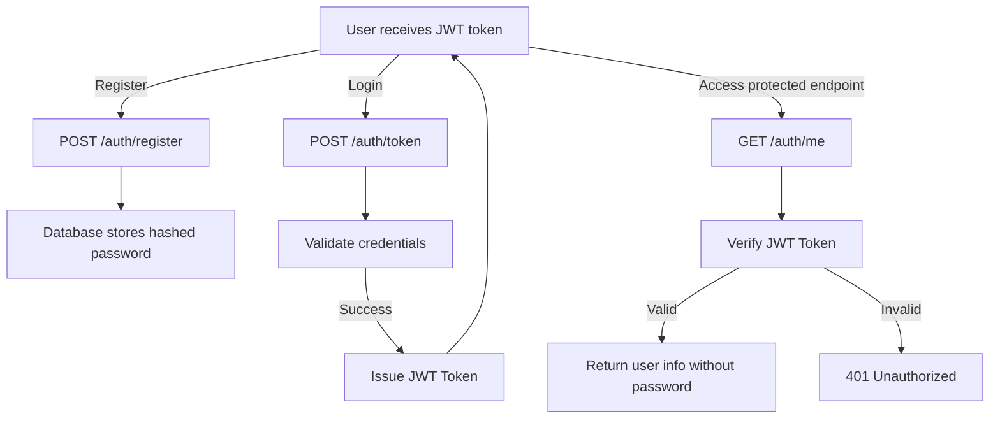

# Custom Identity Platform

A **Custom Identity Platform** built using **Python**, **FastAPI**, **SQLAlchemy**, and **PostgreSQL**.  
This project provides secure user authentication with **JWT tokens**, password hashing, and protected API endpoints.

---

## Table of Contents

- [Features](#features)
- [Dependencies](#dependencies)
- [Setup](#setup)
- [Running the Application](#running-the-application)
- [API Endpoints](#api-endpoints)
- [Quick JWT Authentication Flow Diagram](#quick-jwt-authentication-flow-diagram)
- [Expected Responses](#expected-responses)
- [Contributing](#contributing)

---

## Features

- User registration with hashed passwords
- JWT authentication with OAuth2 password flow
- Protected endpoints using JWT tokens
- Password hashing using **Passlib (bcrypt)**
- PostgreSQL database with Alembic migrations
- Clean project structure for extensibility

---

## Dependencies

This project uses **Poetry** for dependency management.

Key dependencies:

- **FastAPI** – API framework
- **SQLAlchemy** – ORM
- **psycopg2-binary** – PostgreSQL adapter
- **Alembic** – Database migrations
- **Python-JOSE** – JWT handling
- **Passlib[bcrypt]** – Password hashing
- **Authlib** – OAuth2 support
- **Pydantic-settings** – Configuration management
- **python-multipart** – Form data handling
- **email-validator** – Validates emails for user registration

---

## Setup

1. **Clone the repository**:

```bash
git clone https://github.com/henrymbuguakiarie/custom_identity_platform.git
cd custom_identity_platform
````

2. **Install dependencies** using Poetry:

```bash
poetry install
```

3. **Configure your environment**:

* Update `SQLALCHEMY_DATABASE_URL` in `app/config.py` to point to your PostgreSQL database.
* Make sure PostgreSQL is running and a database (e.g., `identity_db`) exists.

4. **Run Alembic migrations**:

```bash
poetry run alembic upgrade head
```

## Running the Application

Start the FastAPI server with Uvicorn:

```bash
poetry run uvicorn app.main:app --reload
```

* Server will run at: [http://127.0.0.1:8000](http://127.0.0.1:8000)
* Interactive API docs available at: [http://127.0.0.1:8000/docs](http://127.0.0.1:8000/docs)

## API Endpoints

| Endpoint         | Method | Description                                       |
| ---------------- | ------ | ------------------------------------------------- |
| `/auth/register` | POST   | Register a new user                               |
| `/auth/token`    | POST   | Authenticate user and obtain JWT token            |
| `/auth/me`       | GET    | Get currently authenticated user info (Protected) |

**Headers**:

```http
Authorization: Bearer <your_jwt_token>
Content-Type: application/json
```

**Sample cURL for Registration**:

```bash
curl -X POST "http://127.0.0.1:8000/auth/register" \
-H "Content-Type: application/json" \
-d '{"username":"testuser","email":"test@example.com","password":"testpass"}'
```

**Sample cURL for Login**:

```bash
curl -X POST "http://127.0.0.1:8000/auth/token" \
-d "username=testuser&password=testpass"
```

**Get Current User (Protected Endpoint):**

- Endpoint: `/auth/me`  
- Method: `GET`  
- Headers: `Authorization: Bearer <your_jwt_token>`

**Sample cURL call:**

```bash
curl -H "Authorization: Bearer <your_jwt_token>" \
  http://127.0.0.1:8000/auth/me
```

## Quick JWT Authentication Flow Diagram



## Expected Responses

**Register User:**

```json
{
  "id": 1,
  "username": "testuser",
  "email": "test@example.com"
}
```

**Login and Get JWT Token:**

```json
{
  "access_token": "<jwt_token>",
  "token_type": "bearer"
}
```

**Get Current User (Protected Endpoint):**

```json
{
  "username": "testuser",
  "email": "test@example.com"
}
```

**Error Example:**

```json
{
  "detail": "Invalid authentication credentials"
}
```

---

## Contributing

1. Fork the repository
2. Create a new branch: `git checkout -b feature-name`
3. Make your changes
4. Commit your changes: `git commit -m 'Add feature'`
5. Push to the branch: `git push origin feature-name`
6. Open a Pull Request

---

**Note:** Ensure the `.env` or any secret files are **not committed** to Git. Add them to `.gitignore`.

